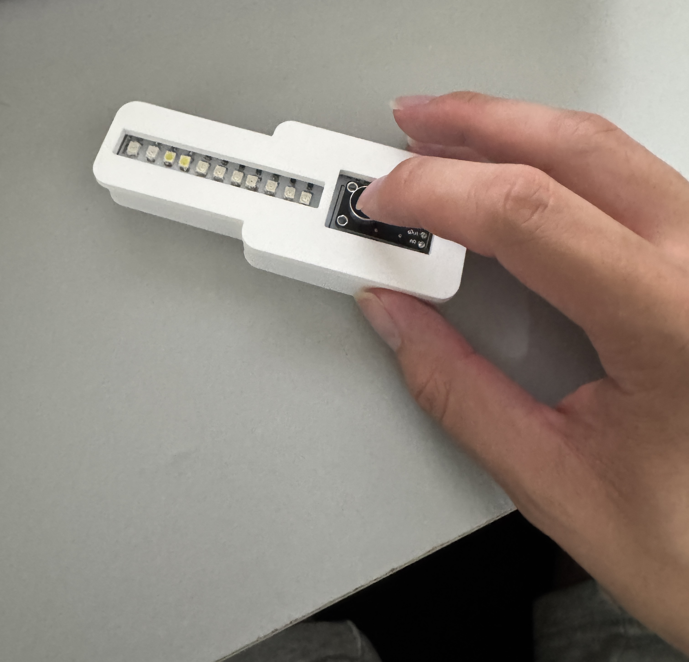
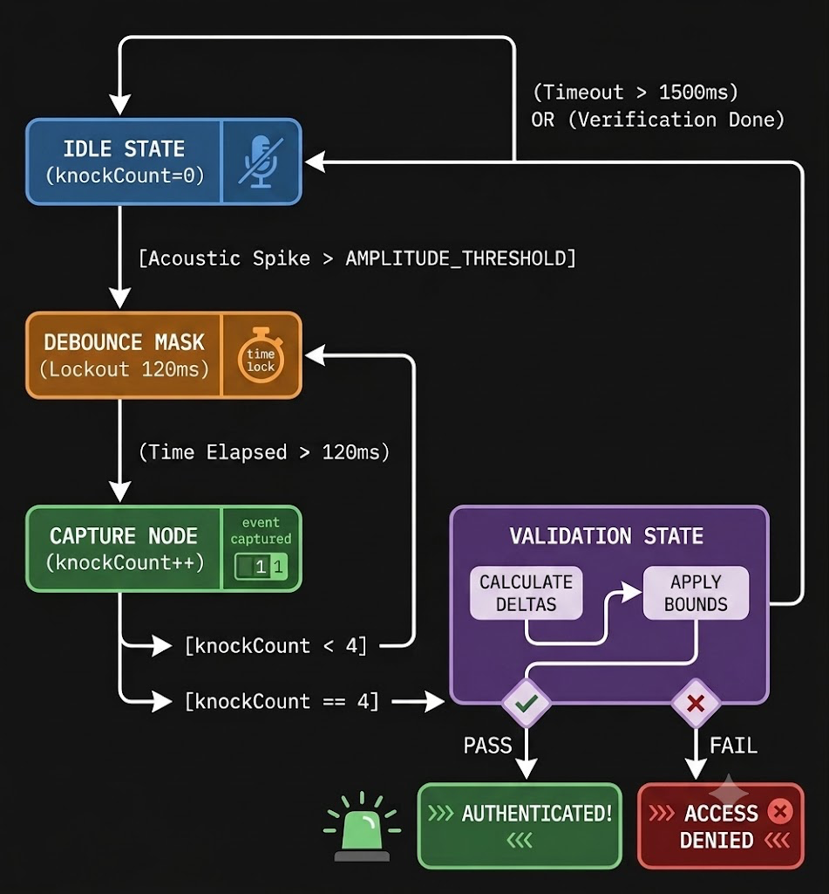
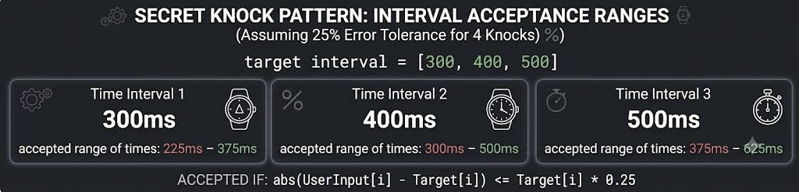
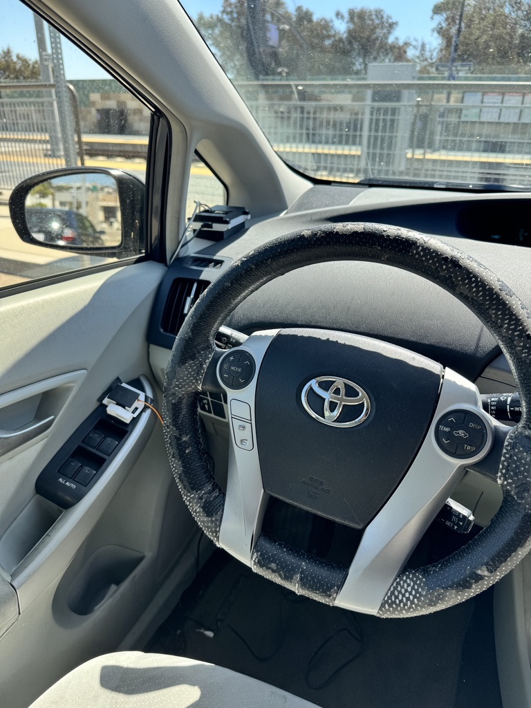

# Secret Knock Detector
## Phillip Mai, ECE 196 SP26

## Abstract
This tutorial covers how to overhaul the software from the original VU meter in Mini Project #1 in order to create a device that can detect secret knocking sequences. Knowledge from ECE 101 (digital signal processing) will be used in order to carry out this tutorial. The secret knock sequence you can choose for this project is completely up to you. You can choose to detect however long or short of a knocking sequence you want, the time intervals between each knock, as well as the error threshold of the knock sequence detection. 

## Intro
Here is a picture of what the device should look like:

*Preview image of tapping/knocking on a microphone device (device will be in enclosure that can be attached to a car door or any door)*


## Objectives
The objective of this tutorial is to guide the creation of a device that can detect a specific tapping/knocking sequence from the user, that will then be used to provide a signal and/or connect to unlock something else. This is mainly designed in relation to my final project, the **Car Autolock** mechanism. Ideally, this would be used to add functionality to the car autolock, so that the car owner can have their own specific tapping/knocking sequence that they perform in order to unlock their car. However, my group was not able to integrate this into our final project, so this tutorial will only cover creating the knocking detection device, not how it will hook up to the **Car Autolock** project. This tutorial follows heavily off of mini project 1, because it is primarily a major firmware extension/upgrade off of mini project 1.

## Supplies
You will need an *ESP32* for this project, as well as the **VU meter** that was designed in Mini Project 1

## Tutorial
Prerequisites:  
Assemble the VU meter as shown in Mini Project #1, if you have not done so already.   
[Light Shield tutorial:](https://docs.google.com/document/d/1Mu_2Po-Syt7JjXysIUL7TWO_k6XdsblgcidHRyinH-4/edit?tab=t.0)  
[ESP32 Board Assembly tutorial:](https://docs.google.com/document/d/1MyPMVRt4JPM1dJQAQRryUGV8kNO14i4SIMXoTIJgecU/edit?tab=t.0)

Set up Arduino IDE as shown in Mini Project #2, if you have not done so already.  
(The first few pages of this tutorial walks through how to setup the Arduino IDE to work with the ESP32)  
[Arduino IDE tutorial:](https://docs.google.com/document/d/1N70qcqzzO3L6botFmQ0oDeWFepuP18lddAu0HNBlQt4/edit?tab=t.0#heading=h.pwaynmqdgkc0)

Topics that are used in this tutorial:  
-Nyquist sampling theoram from ECE101  
-Analog to Digital signal conversion from ECE101  
-Digital Signal processing from ECE101  

## 1. 
We are going to implement this secret knock detector as a state machine. The difficult part of this project compared to the VU meter is that this is no longer just detecting noise in real time, we now need to implement "memory" so the device can remember previous knocks and compare the sequence it detects to the correct sequence. The first step is setting some variables and declaring some functions. The rough outline of how this state machine will work is as follows:   

1: Sample noise and knocks using the microphone  
2: Pass the sampled signal into a function that processes the knocks  
3: Compare the processed knocking sequence to the correct knocking sequence and validate  

Here is a diagram of the state machine to help you understand how this detection system is going to work:  

(The above diagram is AI generated)

The initial variables and declarations are shown below. The variables with asterisks are variables that you will need to tune yourself through testing and debugging. The AMPLITUDE_THRESHOLD variable dictates the noise threshold that will count as a "knock". This depends on the ambient noise of your surroundings. The MAX_KNOCKS variable dictates how many knocks will be required for your secret knocking sequence. The DEBOUNCE_DELAY may also need to be adjusted, because it dictates the required time interval between detected knocks. This is needed because the microphone is so sensitive that the vibrations from a knock may end up registering as multiple knocks, which ruins your knock detection system. 
```
const int MIC_PIN = 1;         // Microphone OUT connected to IO1
const int STATUS_LED = 17;     // Status LED pin

// Array containing all 11 LEDs mapped from bottom to top tip
const int LED_COUNT = 11;
const int ledPins[LED_COUNT] = {
  21, // LED 1 (Bottom)
  26, // LED 2
  47, // LED 3
  33, // LED 4
  34, // LED 5
  48, // LED 6
  35, // LED 7
  36, // LED 8
  37, // LED 9
  38, // LED 10
  39  // LED 11 (Top Tip)
};


const int BIAS_OFFSET = 2048;        // 12-bit ADC midpoint (3.3V / 2)
const int AMPLITUDE_THRESHOLD = *****;  // Threshold to qualify as a "knock" 

// Global Variables for the Timing State Machine
const int MAX_KNOCKS = ***;             // Target pattern length 
unsigned long knockTimestamps[MAX_KNOCKS]; /* Array to keep track of the time interval between knocks for the secret knock sequence */
int knockCount = 0;
unsigned long lastKnockTime = 0;

// Temporal Filtering Constraints
const unsigned long DEBOUNCE_DELAY = 120; // Structural echo mask window (ms)
const unsigned long TIMEOUT_DELAY = 1500; // time before the knock sequence detection is reset

// Forward Declaration of Functions
void processKnockLogic(int currentVolume);
void validatePattern();
```

## 2. 
The second step is the setup portion of the arduino code. This sets the serial baud rate so you can communicate with your board and get some GUI to work with when you are testing/using your secret knock detector. This helps with debugging because it allows you to print statements out. It also sets up the pins and configures the resolution of your analog to digital signal converter. The code will be shown below, to help you get started:
```
void setup() {
  Serial.begin(115200);
  
  // Set up pins as outputs
  pinMode(STATUS_LED, OUTPUT);
  for (int i = 0; i < LED_COUNT; i++) {
    pinMode(ledPins[i], OUTPUT);
  }
  
  // Configure the ESP32-S3 ADC for 12-bit resolution (0 - 4095 range)
  analogReadResolution(12);
  
  Serial.println("System Initialized. Awaiting physical input sequence...");
}
```

# 3.
Now we need to write the looping function, which will loop continuously to sample the noise signals and map it to the LEDs on the VU meter. This is extremely similar in functionality to the VU meter you already implemented in Mini Project #1. You should try to implement this on your own first using your code and knowledge from Mini Project #1, but the code will be provided below:
```
void loop() {
  int rawSample = analogRead(MIC_PIN);
  int AC_Signal = rawSample - BIAS_OFFSET; // Remove DC offset
  int volume = abs(AC_Signal);             // Full-Wave Rectification
  
  // Smoothly map the raw amplitude across all 11 bars
  int ledsToLight = map(volume, 0, 1500, 0, LED_COUNT);
  ledsToLight = constrain(ledsToLight, 0, LED_COUNT);
  
  for (int i = 0; i < LED_COUNT; i++) {
    if (i < ledsToLight) {
      digitalWrite(ledPins[i], HIGH);
    } else {
      digitalWrite(ledPins[i], LOW);
    }
  }
  
  processKnockLogic(volume);
  
  // Strict timing constraint to lock sampling rate near ~1kHz (Nyquist compliance)
  delayMicroseconds(1000);
}
```

## 4.
Now we need to implement the 2 most important functions of this tutorial. These functions are `processKnockLogic`, which processes knocks, and `validatePattern`, which checks if the knock sequence detected matches the secret knock sequence. This tutorial will lay out the necessary steps you need to implement in each of these functions, which you will then use to try implementing them yourself. To keep this tutorial complete, solution code will be provided below.

For `processKnockLogic`:  
-Keep track of current time in milliseconds  
-If a noise is detected that is above the amplitude threshold set earlier, register it as a knock and record the time it was detected. Write time into `knockTimestamps` array. Increment `knockCount`.  
-Keep track of last recorded knock time. If too much time has passed since then (TIMEOUT_DELAY), reset the entire array.    
-If number of knocks detected reaches `MAX_KNOCKS` set earlier, then the `knockTimestamps` array is full. Call `validatePattern` and reset `knockCount`.  

For `validatePattern`:  
-Set a target intervals array that holds the time intervals between each knock of the secret knock sequence that you want to have. This is the main thing that controls the nature secret knock sequence you want.  
-Set a error tolerance. The user will never be able to time it perfectly between knocks, so build in a buffer of time that will be acceptable for the detected sequence in `knockTimestamps` to be registered as correct.   
-Use the detected timestamps in the `knockTimestamps` array to compare to the target intervals (plus/minus the error tolerance). If the detected time intervals match the targeted intervals, then validate the sequence and print some success message.

Here is a visual of how the error tolerances should work:
```
Assuming error tolerance is 25% for a secret knock sequence of 4 knocks:  
target interval = [300,400,500]
Time interval 1 accepted range of times: 225ms - 375ms
Time interval 2 accepted range of times: 300ms - 500ms
Time interval 3 accepted range of times: 375ms - 625ms
```


(The above image is AI generated)

Solution code for `processKnockLogic`:
```
void processKnockLogic(int currentVolume) {
  unsigned long currentTime = millis();
  
  // Check for dynamic timeout event
  if (knockCount > 0 && (currentTime - lastKnockTime > TIMEOUT_DELAY)) {
    Serial.println("Pattern Timeout. Resetting buffer.");
    knockCount = 0;
  }
  
  // Peak Detection Filter + Temporal Blanking (Debouncing)
  if (currentVolume > AMPLITUDE_THRESHOLD) {
    if (currentTime - lastKnockTime > DEBOUNCE_DELAY) {
      
      // Commit feature to volatile memory
      knockTimestamps[knockCount] = currentTime;
      knockCount++;
      lastKnockTime = currentTime;
      
      Serial.print("Feature Captured: ");
      Serial.print(knockCount);
      Serial.print("/");
      Serial.println(MAX_KNOCKS);
      
      // Simple strobe on the Status LED for immediate user feedback
      digitalWrite(STATUS_LED, HIGH);
      delay(40); 
      digitalWrite(STATUS_LED, LOW);
      
      // Evaluate if the sequence vector is complete
      if (knockCount == MAX_KNOCKS) {
        validatePattern();
        knockCount = 0; // Flush sequence container
      }
    }
  }
}
```

Solution code for `validatePattern`:
```
void validatePattern() {
  // Secret Target Intervals (Rhythm: Shave and a Haircut style start)
  const int targetIntervals[MAX_KNOCKS - 1] = {600, 300, 300};
  
  int detectedIntervals[MAX_KNOCKS - 1];
  bool patternMatches = true;
  float errorTolerance = 0.35; // Accept human cadency drift up to +/- 35%
  
  Serial.println("\nExecuting Time-Domain Pattern Validation...");
  
  // Calculate delta time mapping arrays
  for (int i = 0; i < MAX_KNOCKS - 1; i++) {
    detectedIntervals[i] = knockTimestamps[i+1] - knockTimestamps[i];
  }
  
  // Error evaluation loop
  for (int i = 0; i < MAX_KNOCKS - 1; i++) {
    int lowBound = targetIntervals[i] * (1.0 - errorTolerance);
    int highBound = targetIntervals[i] * (1.0 + errorTolerance);
    
    Serial.print("Node "); Serial.print(i);
    Serial.print(" -> Bound: ["); Serial.print(lowBound);
    Serial.print("ms to "); Serial.print(highBound);
    Serial.print("ms] | Received: "); Serial.print(detectedIntervals[i]); Serial.println("ms");
    
    if (detectedIntervals[i] < lowBound || detectedIntervals[i] > highBound) {
      patternMatches = false; // Bounds violation discovered
    }
  }
  
  // Deterministic Output Execution state
  if (patternMatches) {
    Serial.println(">>> VERIFICATION SUCCESS: Pattern Authenticated! <<<\n");
    // Visual alarm: Flash the entire VU array 3 times
    for (int x = 0; x < 3; x++) {
      for (int i = 0; i < LED_COUNT; i++) digitalWrite(ledPins[i], HIGH);
      delay(100);
      for (int i = 0; i < LED_COUNT; i++) digitalWrite(ledPins[i], LOW);
      delay(100);
    }
  } else {
    Serial.println(">>> VERIFICATION FAILURE: Sequence Rejected. <<<\n");
  }
}
```

After these have been implemented, then the secret knock sequence detector will be complete, and you can hook this into any project as you see fit, such as the car autolock project shown below. This device could be connected to the car so that the autolock system unlocks the car when the secret knock is detected.  
[Link to Car Autolock Project website:](https://sites.google.com/ucsd.edu/ece-196-project-site-awjypm/home?authuser=1)


## Resources
[Link to useful reading on ADC and Nyquist Sampling](https://www.techtarget.com/whatis/definition/analog-to-digital-conversion-ADC)
